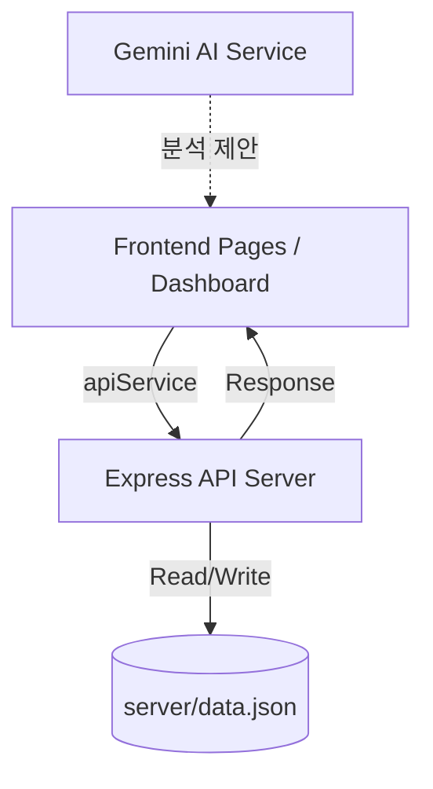

# APCTT TechTransfer Connect - 플랫폼 구조 개괄 (Architecture Overview)

이 문서는 Asia-Pacific TechTransfer Connect 플랫폼의 기술적 구조와 주요 기능을 설명합니다.

## 1. 프로젝트 개요
APCTT TechTransfer Connect는 아시아 태평양 지역 내 기술 이전, 협력 및 기술 수요-공급 매칭을 촉진하기 위해 설계된 플랫폼입니다.

## 2. 기술 스택 (Tech Stack)

| 레이어 | 기술 |
|----------|------------|
| **Frontend** | React, TypeScript, Vite |
| **Backend** | Node.js, Express, TypeScript |
| **데이터 저장소** | JSON 기반 소형 데이터베이스 (`server/data.json`) |
| **AI 기능** | Google Gemini API (스마트 매치메이커용) |
| **스타일링** | Vanilla CSS (커스텀 디자인 시스템) |
| **아이콘** | Lucide React |

## 3. 디렉토리 구조 (Directory Structure)

```text
apctt-techtransfer-connect/
├── components/          # 공통 UI 컴포넌트 (Navbar 등)
├── context/             # 전역 상태 관리 (인증, 설정, 채팅, 기회 등)
├── pages/               # 주요 페이지 컴포넌트 (기술 목록, 매치메이커, 대시보드 등)
├── server/              # 백엔드 서버 폴더
│   ├── data.json        # 통합 데이터 저장소 (기술, 기관, 수요, 사용자 정보 등)
│   └── index.ts         # Express 서버 엔트리 포인트 및 API 라우팅
├── services/            # 외부 통신 서비스
│   ├── apiService.ts    # 백엔드 API 연동 서비스
│   └── geminiService.ts # Gemini AI 연동 서비스
├── types.ts             # 전역 TypeScript 타입 정의
└── App.tsx              # 라우팅 및 Context Provider 설정
```

## 4. 주요 기능 및 모듈 (Key Features)

### A. 핵심 디렉토리 (Core Directories)
- **Technologies**: 기술 공급자가 등록한 기술 목록 조회 및 상세 정보 확인.
- **Stakeholders**: 인증된 파트너 기관 및 투자자 디렉토리.
- **Needs Directory**: 기술적 해결책이 필요한 기업/개인의 기술 수요(Requirements) 조회.
- **Opportunities**: 이벤트, 투어, 서비스 등 네트워크 내 새로운 소식 공유.

### B. 사용자 역할 및 권한 (RBAC)
`AuthContext`를 통해 네 가지 주요 사용자 시나리오를 지원합니다:
1. **Platform Admin**: 플랫폼 전체 거버넌스, 아이덴티티 검토 및 관리.
2. **Organization Representative**: 기관의 기술 포트폴리오 및 구성원 관리 권한.
3. **Organization Member**: 소속 기관의 데이터를 조회하고 관련 협의 참여.
4. **Individual**: 독립적인 혁신가 또는 초기 수요자 수준의 접근.

### C. AI 스마트 매치메이커 (AI Integration)
사용자가 자연어로 요구사항을 입력하면, Gemini AI가 플랫폼 내의 기술 및 파트너 데이터를 분석하여 가장 적합한 매치를 제안합니다.

## 5. 데이터 흐름 (Data Flow)



1. **요청 (Request)**: 프론트엔드에서 기술 등록이나 조회를 수행하면 `apiService.ts`를 통해 백엔드로 요청을 보냅니다.
2. **처리 (Processing)**: Express 서버(`server/index.ts`)에서 요청을 받아 비즈니스 로직을 처리합니다.
3. **저장 (Persistence)**: 모든 데이터는 `server/data.json`에 영구적으로 저장됩니다.
4. **동기화 (Sync)**: 대시보드에서 등록한 새로운 기술은 즉시 전체 'Technologies' 페이지에 반영됩니다.

## 6. 인증 및 검증 시스템
- **2단계 검증**: 이메일 인증 후, 비즈니스 등록 서류 업로드를 통해 'Verified Partner' 배지를 획득할 수 있습니다.
- **관리자 검토**: 플랫폼 관리자는 대시보드에서 보류 중인 신원 확인 서류를 검토하고 승인할 수 있습니다.
